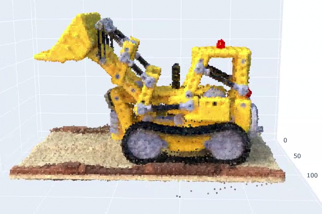

# Project Name

Inspired by Plenoxels, This project uses a sparse voxel grid to optimize a collection of 2D images to a 3d representation. 

  

## Setup

1. Clone the repository and navigate to the root directory of the project.
2. Download the dataset and place it in the data folder.
3.Run `pip install -r requirements.txt`.
4. Run `python scripts/main.py` to start the training process.

## Dataset
get the NeRF-synthetic from: https://drive.google.com/drive/folders/128yBriW1IG_3NJ5Rp7APSTZsJqdJdfc1 (nerf_synthetic.zip).

## Scripts

### compare_inference_to_image.py
Inference of a test image with a trained grid.

### main.py
 runs the entire optimization process.

### train.py
A script that trains the model using the provided dataset.

### visulize_camera_and_grid.py
Visualizes cameras position and orientation along with the voxel grid.

### visulize_grid.py
Displays and saves a 3D view of the voxel grid in an HTML file.

## Saving Results
The trained model and other parameters will be saved in the `src/grid_cells_trained.pth` file.